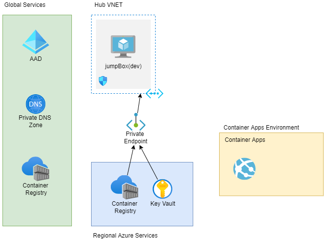

# __Contense__ 

## __Description__
Spin up azure infrastructure with necessary components already setup, linked and ready to iterate.

## __Motivation__
Architecting an infrastructure requires going through many decisions and there are many contraint to think about.
I wanted to document experiences and knowledge gained throughout my journey in tech and create an infrastructure that have already been thought through. Also, the infrastructure should be flexible such that it could be applied to any domain. The goal is to create a base architecture that could be easy to extend and spin up an infrastructure with performance, security, cost and agility optimized.  

## __Diagram__
### __Architecture Diagram__

### __Bicep Visualisation__

## __Setup Instruction__
1. run `az login`
2. copy `rg.parameters.json` to `rg.parameters.local.json`
3. fill in the parameters in `rg.parameters.local.json`
4. Generate a SSH key `ssh-keygen -t rsa -b 4096` if it does not exists 
5. run `main.ps1`

__Note__ by default, it searches the SSH keys in `~/.ssh/id_rsa.pub`.   
Main script will be in `main.ps1`
